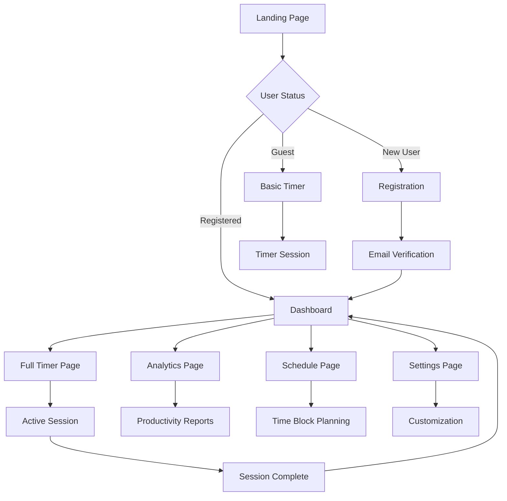

# StrayDog Pomodoro TimeBlock Application - Product Requirements Document

## 1. Product Overview

A premium MERN Stack productivity application that combines Pomodoro Technique with time-blocking methodology, featuring a modern glassmorphic design. <mcreference link="https://claude.ai/public/artifacts/6e16bc25-55a5-4bc8-8271-b8b09a565fd6" index="0">0</mcreference>

The application helps users maximize productivity through structured time management, offering real-time session tracking, comprehensive analytics, and an intuitive user experience designed for professionals and students seeking enhanced focus and productivity.

## 2. Core Features

### 2.1 User Roles

| Role | Registration Method | Core Permissions |
|------|---------------------|------------------|
| Guest User | No registration required | Can use basic timer functionality, limited session history |
| Registered User | Email registration with verification | Full access to all features, unlimited session history, analytics, custom settings |
| Premium User | Subscription upgrade | Advanced analytics, team collaboration features, priority support |

### 2.2 Feature Module

Our Pomodoro TimeBlock application consists of the following main pages:

1. **Dashboard**: Real-time timer display, quick start options, daily progress overview, session statistics cards
2. **Timer Page**: Interactive Pomodoro timer, time block scheduler, session controls, break notifications
3. **Analytics Page**: Comprehensive session statistics, productivity charts, weekly/monthly reports, goal tracking
4. **Schedule Page**: Time block calendar view, task planning, session scheduling, recurring time blocks
5. **Settings Page**: Timer customization, notification preferences, theme selection, account management
6. **Authentication Pages**: Login and registration forms with email verification

### 2.3 Page Details

| Page Name | Module Name | Feature description |
|-----------|-------------|---------------------|
| Dashboard | Quick Stats | Display today's completed sessions, total focus time, productivity score with animated counters |
| Dashboard | Active Timer | Show current session status, remaining time, session type (work/break) with glassmorphic design |
| Dashboard | Recent Sessions | List last 5 sessions with duration, task name, completion status |
| Timer Page | Pomodoro Timer | Start/pause/stop timer, customizable work/break intervals, audio notifications, visual progress ring |
| Timer Page | Session Controls | Skip break, extend session, add notes, mark task completion |
| Timer Page | Time Block Scheduler | Drag-and-drop time blocks, task assignment, color coding, conflict detection |
| Analytics Page | Session Statistics | Total sessions, average focus time, productivity trends with interactive charts |
| Analytics Page | Performance Charts | Daily/weekly/monthly views using Recharts, goal progress tracking |
| Analytics Page | Export Data | Download session data as CSV/PDF, share productivity reports |
| Schedule Page | Calendar View | Monthly/weekly calendar with scheduled time blocks, task assignments |
| Schedule Page | Task Management | Create/edit/delete tasks, priority levels, estimated duration |
| Settings Page | Timer Configuration | Customize work/break durations, long break intervals, auto-start options |
| Settings Page | Notifications | Sound selection, desktop notifications, break reminders |
| Settings Page | Profile Management | Update user information, change password, account preferences |
| Login Page | Authentication | Email/password login, remember me option, forgot password link |
| Register Page | User Registration | Email registration, password validation, terms acceptance |

## 3. Core Process

**Guest User Flow:**
Users can immediately start using the basic timer functionality without registration. They can set custom work/break intervals and track their current session, but session history is limited to the current browser session.

**Registered User Flow:**
After registration and email verification, users access the full dashboard with comprehensive analytics. They can create time blocks, schedule sessions, customize timer settings, and view detailed productivity reports. The application saves all session data and provides insights into productivity patterns.

**Premium User Flow:**
Premium users get additional features like team collaboration, advanced analytics with longer historical data, and priority customer support.

## 4. User Interface Design

### 4.1 Design Style

- **Primary Colors**: StrayDog Primary (#355E3B), Charcoal (#1E1E1E), Sage (#A3B9A4) <mcreference link="https://claude.ai/public/artifacts/6e16bc25-55a5-4bc8-8271-b8b09a565fd6" index="0">0</mcreference>
- **Secondary Colors**: Stray White (#F5F5F5), Silver (#C2C2C2), Graphite (#3F3F3F)
- **Glass Effects**: Semi-transparent overlays with backdrop blur (rgba values with 0.1-0.3 opacity)
- **Button Style**: Glassmorphic design with subtle shadows, rounded corners, hover animations
- **Typography**: Inter (primary), JetBrains Mono (timers/code), Space Grotesk (headings) <mcreference link="https://fonts.googleapis.com/css2?family=Inter:wght@300;400;500;600;700;800&display=swap" index="1">1</mcreference> <mcreference link="https://fonts.googleapis.com/css2?family=JetBrains+Mono:wght@300;400;500;600;700&display=swap" index="2">2</mcreference> <mcreference link="https://fonts.googleapis.com/css2?family=Space+Grotesk:wght@300;400;500;600;700&display=swap" index="3">3</mcreference>
- **Layout Style**: Card-based layout with glassmorphic containers, floating elements, subtle animations
- **Icons**: Lucide React icons with consistent sizing and stroke width
- **Animations**: Framer Motion for smooth transitions, micro-interactions, loading states

### 4.2 Page Design Overview

| Page Name | Module Name | UI Elements |
|-----------|-------------|-------------|
| Dashboard | Stats Cards | Glassmorphic cards with backdrop blur, animated counters, subtle glow effects, Inter font for numbers |
| Dashboard | Timer Widget | Circular progress indicator, JetBrains Mono for time display, floating animation, glass morphism background |
| Timer Page | Main Timer | Large circular timer with SVG progress ring, glassmorphic center panel, pulsing glow animation during active sessions |
| Timer Page | Control Buttons | Rounded glassmorphic buttons with hover effects, Lucide icons, smooth state transitions |
| Analytics Page | Charts Container | Semi-transparent chart backgrounds, custom Recharts styling, gradient overlays, smooth data transitions |
| Schedule Page | Calendar Grid | Glassmorphic calendar cells, drag-and-drop visual feedback, color-coded time blocks, hover states |
| Settings Page | Form Controls | Glassmorphic input fields, custom toggles, slider components with StrayDog brand colors |
| Auth Pages | Form Layout | Centered glassmorphic form containers, floating labels, validation feedback with smooth animations |

### 4.3 Responsiveness

The application is desktop-first with mobile-adaptive design. Touch interaction optimization is implemented for mobile devices, including:
- Larger touch targets for timer controls
- Swipe gestures for navigation
- Responsive glassmorphic effects that maintain performance on mobile
- Adaptive typography scaling
- Collapsible navigation for smaller screens
- Touch-friendly drag-and-drop for time block scheduling