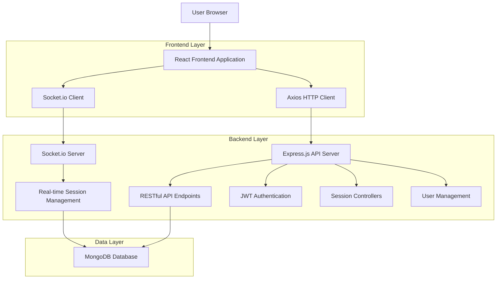
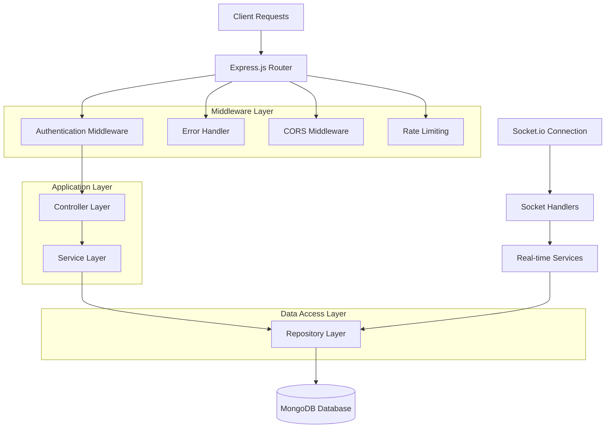
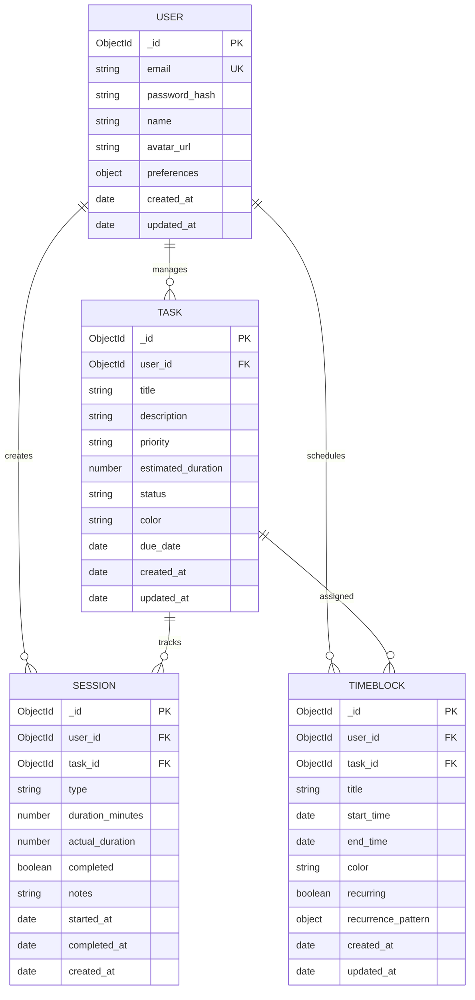

# StrayDog Pomodoro TimeBlock Application - Technical Architecture Document

## 1. Architecture Design



## 2. Technology Description

* **Frontend**: React\@18.3.1 + TypeScript + Vite + TailwindCSS\@3.4.7

* **Backend**: Node.js + Express\@4 + TypeScript + Socket.io\@4.7.5

* **Database**: MongoDB with Mongoose ODM

* **Authentication**: JWT (JSON Web Tokens)

* **Real-time**: Socket.io for live session updates

* **State Management**: Zustand\@4.5.4

* **Forms**: React Hook Form\@7.52.2

* **Animations**: Framer Motion\@11.3.24

* **Charts**: Recharts\@2.12.7

* **Icons**: Lucide React\@0.400.0

* **HTTP Client**: Axios\@1.7.2

* **Development**: Concurrently for parallel dev servers

## 3. Route Definitions

| Route            | Purpose                                                              |
| ---------------- | -------------------------------------------------------------------- |
| /                | Dashboard page, displays user statistics and quick timer access      |
| /timer           | Main timer page with Pomodoro functionality and time block scheduler |
| /analytics       | Analytics dashboard with session statistics and productivity charts  |
| /schedule        | Calendar view for time block planning and task management            |
| /settings        | User preferences, timer configuration, and account settings          |
| /login           | User authentication page with email/password login                   |
| /register        | User registration page with email verification                       |
| /forgot-password | Password reset functionality                                         |
| /profile         | User profile management and account details                          |

## 4. API Definitions

### 4.1 Core API

**User Authentication**

```
POST /api/auth/register
```

Request:

| Param Name | Param Type | isRequired | Description                     |
| ---------- | ---------- | ---------- | ------------------------------- |
| email      | string     | true       | User email address              |
| password   | string     | true       | Password (minimum 8 characters) |
| name       | string     | true       | User full name                  |

Response:

| Param Name | Param Type | Description              |
| ---------- | ---------- | ------------------------ |
| success    | boolean    | Registration status      |
| message    | string     | Success or error message |
| token      | string     | JWT authentication token |

```
POST /api/auth/login
```

Request:

| Param Name | Param Type | isRequired | Description        |
| ---------- | ---------- | ---------- | ------------------ |
| email      | string     | true       | User email address |
| password   | string     | true       | User password      |

Response:

| Param Name | Param Type | Description              |
| ---------- | ---------- | ------------------------ |
| success    | boolean    | Login status             |
| token      | string     | JWT authentication token |
| user       | object     | User profile information |

**Session Management**

```
POST /api/sessions
```

Request:

| Param Name | Param Type | isRequired | Description                          |
| ---------- | ---------- | ---------- | ------------------------------------ |
| type       | string     | true       | Session type (work/break/long-break) |
| duration   | number     | true       | Session duration in minutes          |
| taskId     | string     | false      | Associated task ID                   |

```
GET /api/sessions
```

Response:

| Param Name     | Param Type | Description                   |
| -------------- | ---------- | ----------------------------- |
| sessions       | array      | Array of user session objects |
| totalSessions  | number     | Total number of sessions      |
| totalFocusTime | number     | Total focus time in minutes   |

**Time Block Management**

```
POST /api/timeblocks
```

Request:

| Param Name | Param Type | isRequired | Description                          |
| ---------- | ---------- | ---------- | ------------------------------------ |
| title      | string     | true       | Time block title                     |
| startTime  | string     | true       | ISO date string for start time       |
| endTime    | string     | true       | ISO date string for end time         |
| taskId     | string     | false      | Associated task ID                   |
| color      | string     | false      | Color code for visual identification |

```
GET /api/timeblocks
```

Query Parameters:

| Param Name | Param Type | isRequired | Description                    |
| ---------- | ---------- | ---------- | ------------------------------ |
| startDate  | string     | false      | Filter start date (ISO format) |
| endDate    | string     | false      | Filter end date (ISO format)   |

**Analytics**

```
GET /api/analytics/stats
```

Response:

| Param Name        | Param Type | Description                        |
| ----------------- | ---------- | ---------------------------------- |
| dailyStats        | object     | Daily productivity statistics      |
| weeklyStats       | object     | Weekly productivity trends         |
| monthlyStats      | object     | Monthly performance data           |
| productivityScore | number     | Overall productivity score (0-100) |

## 5. Server Architecture Diagram



## 6. Data Model

### 6.1 Data Model Definition



### 6.2 Data Definition Language

**User Collection**

```javascript
// User schema
const userSchema = new mongoose.Schema({
  email: {
    type: String,
    required: true,
    unique: true,
    lowercase: true,
    trim: true
  },
  password_hash: {
    type: String,
    required: true
  },
  name: {
    type: String,
    required: true,
    trim: true
  },
  avatar_url: {
    type: String,
    default: null
  },
  preferences: {
    work_duration: { type: Number, default: 25 },
    short_break: { type: Number, default: 5 },
    long_break: { type: Number, default: 15 },
    sessions_until_long_break: { type: Number, default: 4 },
    notifications_enabled: { type: Boolean, default: true },
    sound_enabled: { type: Boolean, default: true },
    theme: { type: String, default: 'glassmorphic' }
  }
}, {
  timestamps: true
});

// Indexes
userSchema.index({ email: 1 });
userSchema.index({ created_at: -1 });
```

**Session Collection**

```javascript
// Session schema
const sessionSchema = new mongoose.Schema({
  user_id: {
    type: mongoose.Schema.Types.ObjectId,
    ref: 'User',
    required: true
  },
  task_id: {
    type: mongoose.Schema.Types.ObjectId,
    ref: 'Task',
    default: null
  },
  type: {
    type: String,
    enum: ['work', 'short_break', 'long_break'],
    required: true
  },
  duration_minutes: {
    type: Number,
    required: true
  },
  actual_duration: {
    type: Number,
    default: 0
  },
  completed: {
    type: Boolean,
    default: false
  },
  notes: {
    type: String,
    default: ''
  },
  started_at: {
    type: Date,
    required: true
  },
  completed_at: {
    type: Date,
    default: null
  }
}, {
  timestamps: true
});

// Indexes
sessionSchema.index({ user_id: 1, created_at: -1 });
sessionSchema.index({ user_id: 1, type: 1 });
sessionSchema.index({ started_at: 1 });
```

**TimeBlock Collection**

```javascript
// TimeBlock schema
const timeBlockSchema = new mongoose.Schema({
  user_id: {
    type: mongoose.Schema.Types.ObjectId,
    ref: 'User',
    required: true
  },
  task_id: {
    type: mongoose.Schema.Types.ObjectId,
    ref: 'Task',
    default: null
  },
  title: {
    type: String,
    required: true,
    trim: true
  },
  start_time: {
    type: Date,
    required: true
  },
  end_time: {
    type: Date,
    required: true
  },
  color: {
    type: String,
    default: '#355E3B'
  },
  recurring: {
    type: Boolean,
    default: false
  },
  recurrence_pattern: {
    frequency: { type: String, enum: ['daily', 'weekly', 'monthly'] },
    interval: { type: Number, default: 1 },
    days_of_week: [{ type: Number, min: 0, max: 6 }],
    end_date: { type: Date }
  }
}, {
  timestamps: true
});

// Indexes
timeBlockSchema.index({ user_id: 1, start_time: 1 });
timeBlockSchema.index({ user_id: 1, end_time: 1 });
```

**Task Collection**

```javascript
// Task schema
const taskSchema = new mongoose.Schema({
  user_id: {
    type: mongoose.Schema.Types.ObjectId,
    ref: 'User',
    required: true
  },
  title: {
    type: String,
    required: true,
    trim: true
  },
  description: {
    type: String,
    default: ''
  },
  priority: {
    type: String,
    enum: ['low', 'medium', 'high', 'urgent'],
    default: 'medium'
  },
  estimated_duration: {
    type: Number,
    default: 25
  },
  status: {
    type: String,
    enum: ['todo', 'in_progress', 'completed', 'cancelled'],
    default: 'todo'
  },
  color: {
    type: String,
    default: '#355E3B'
  },
  due_date: {
    type: Date,
    default: null
  }
}, {
  timestamps: true
});

// Indexes
taskSchema.index({ user_id: 1, status: 1 });
taskSchema.index({ user_id: 1, due_date: 1 });
taskSchema.index({ user_id: 1, created_at: -1 });
```

**Initial Data Setup**

```javascript
// Default user preferences
const defaultPreferences = {
  work_duration: 25,
  short_break: 5,
  long_break: 15,
  sessions_until_long_break: 4,
  notifications_enabled: true,
  sound_enabled: true,
  theme: 'glassmorphic'
};

// Sample task categories
const defaultTaskCategories = [
  { name: 'Work', color: '#355E3B' },
  { name: 'Study', color: '#A3B9A4' },
  { name: 'Personal', color: '#3F3F3F' },
  { name: 'Exercise', color: '#C2C2C2' }
];
```

